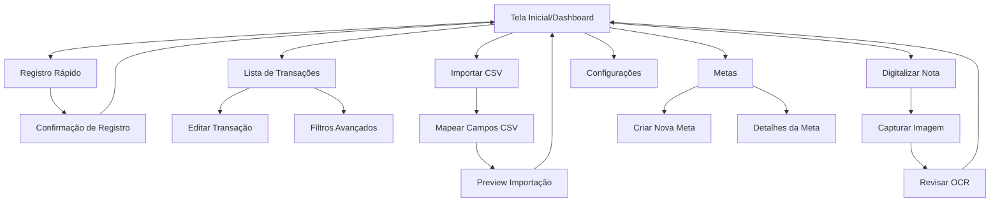

## 1. Visão Geral do Produto

O Controlador Financeiro PWA do Enzo é uma aplicação web progressiva desenvolvida para gerenciamento pessoal de finanças, focada na simplicidade e agilidade no registro de transações financeiras. O produto visa resolver o problema do controle financeiro informal que o Enzo e sua mãe enfrentam no trabalho de limpeza pós-obra, onde precisam registrar rapidamente ganhos diários e despesas recorrentes.

**Público-alvo:** Enzo e sua mãe, trabalhadores autônomos na área de limpeza pós-obra que necessitam de controle financeiro simples e eficiente via smartphone.

**Valor de mercado:** Ferramenta essencial para microempreendedores e trabalhadores autônomos brasileiros que precisam de organização financeira sem complexidade de sistemas empresariais.

## 2. Funcionalidades Principais

### 2.1 Usuário Principal
| Usuário | Método de Acesso | Permissões Principais |
|---------|-------------------|----------------------|
| Enzo (Administrador) | Magic link via email | Acesso completo: registro de transações, importação CSV, OCR, dashboard, configurações |
| Mãe do Enzo (Usuário) | Magic link via email | Registro de transações, visualização de dashboard, edição próprias transações |

### 2.2 Módulos de Funcionalidades

O Controlador Financeiro consiste nas seguintes páginas principais:
1. **Dashboard**: Visão geral financeira, saldo atual, gráficos de tendências, últimas transações.
2. **Registro Rápido**: Tela principal para adicionar ganhos/despesas em 3 cliques ou menos.
3. **Transações**: Lista completa com filtros, busca e edição de lançamentos.
4. **Importar CSV**: Upload e processamento de extratos bancários em formato CSV.
5. **Digitalizar Nota**: Funcionalidade OCR para capturar dados de notas fiscais via câmera.
6. **Metas**: Definição e acompanhamento de objetivos financeiros mensais.
7. **Configurações**: Perfil do usuário, categorias personalizadas, exportação de dados.

### 2.3 Detalhamento das Páginas

| Página | Módulo | Descrição das Funcionalidades |
|--------|--------|-------------------------------|
| Dashboard | Visão Geral | Exibir saldo atual, total de ganhos e despesas do mês, gráfico de tendência dos últimos 30 dias. |
| Dashboard | Últimas Transações | Listar 5 transações mais recentes com ícone de categoria, valor e data. |
| Dashboard | Navegação Rápida | Botões grandes para "Novo Ganho" e "Nova Despesa" com acesso em 1 clique. |
| Registro Rápido | Formulário Simplificado | Campos: valor (teclado numérico grande), categoria (lista pré-definida), descrição opcional, data padrão hoje. |
| Registro Rápido | Confirmação | Tela de confirmação com os dados inseridos e botão "Confirmar" destacado. |
| Transações | Lista Filtrável | Tabela com transações ordenadas por data decrescente, filtros por período, categoria e tipo (ganho/despesa). |
| Transações | Ações Rápidas | Botões de editar e excluir com confirmação de segurança. |
| Importar CSV | Upload de Arquivo | Seletor de arquivo CSV com preview dos primeiros 10 registros antes da importação. |
| Importar CSV | Mapeamento de Campos | Interface drag-and-drop para associar colunas do CSV aos campos da aplicação (data, descrição, valor). |
| Digitalizar Nota | Câmera/Upload | Captura de imagem da nota fiscal ou upload de foto existente. |
| Digitalizar Nota | Processamento OCR | Exibição do resultado do OCR com campos editáveis antes da confirmação. |
| Metas | Definição de Meta | Formulário para criar meta mensal com valor alvo, categoria e prazo. |
| Metas | Acompanhamento | Barra de progresso visual mostrando percentual atingido e dias restantes. |
| Configurações | Perfil | Edição de nome, email e preferências de notificação. |
| Configurações | Categorias | CRUD completo de categorias personalizadas com ícones e cores. |

## 3. Fluxo de Navegação Principal

### Fluxo do Enzo (Administrador)
1. Acesso via PWA instalado no smartphone
2. Dashboard mostra visão geral financeira instantânea
3. Registro rápido de ganhos diários da limpeza pós-obra
4. Lançamento de despesas recorrentes (combustível, materiais, alimentação)
5. Importação mensal de extratos bancários via CSV
6. Digitalização de notas fiscais importantes via OCR
7. Acompanhamento de metas financeiras mensais

### Fluxo da Mãe do Enzo (Usuário)
1. Acesso simplificado via magic link
2. Dashboard com foco em registro rápido
3. Lançamento de suas transações diárias
4. Visualização do progresso geral das finanças

## 4. Design de Interface

### 4.1 Estilo Visual
- **Cores Primárias:** Verde (#10B981) para ganhos, Vermelho (#EF4444) para despesas, Azul (#3B82F6) para ações principais
- **Cores Secundárias:** Cinza claro (#F3F4F6) para fundos, Branco (#FFFFFF) para cards
- **Botões:** Estilo rounded com sombras suaves, tamanhos grandes para fácil toque
- **Tipografia:** Fonte sans-serif moderna (Inter ou similar), tamanhos: 16px corpo, 24px títulos, 32px valores principais
- **Layout:** Card-based com navegação inferior fixa (estilo app mobile)
- **Ícones:** Estilo outline minimalista, preferencialmente usando emojis BR relevantes (💰, 🏠, 🚗, 🍽️)

### 4.2 Elementos por Página

| Página | Módulo | Elementos de UI |
|--------|--------|------------------|
| Dashboard | Header | Logo do app, nome do usuário, ícone de configurações, saldo em destaque com R$ grande. |
| Dashboard | Cards Resumo | Cards coloridos com: ganhos do mês (verde), despesas do mês (vermelho), saldo (azul), cada um com ícone e valor. |
| Dashboard | Gráfico | Gráfico de linha simples mostrando balanço dos últimos 30 dias, com tooltips ao tocar. |
| Registro Rápido | Teclado Numérico | Teclado grande ocupando metade da tela, com botões de 60px de altura mínima. |
| Registro Rápido | Seletor Categoria | Grid de botões com ícones grandes (4 por linha), categorias pré-definidas para o contexto deles. |
| Transações | Lista | Cards expansíveis com data, descrição, categoria com ícone, valor com cor correspondente. |
| Importar CSV | Drop Zone | Área grande para arrastar arquivo, com texto claro "Arraste seu CSV aqui ou toque para selecionar". |
| Metas | Progresso Visual | Barra horizontal grossa (24px) com gradiente de cor mostrando progresso, texto "X% completo - R$ Y de R$ Z". |

### 4.3 Responsividade e Acessibilidade
- **Mobile-First:** Design otimizado principalmente para smartphones Android/iOS
- **Touch-Friendly:** Todos elementos interativos com mínimo de 48px de área de toque
- **PWA Instalável:** Splash screen personalizado, ícone na home screen, funcionamento offline básico
- **Português BR:** Todo texto em português do Brasil, com termos familiares ao contexto deles
- **Alto Contraste:** Opção de tema escuro para economia de bateria e melhor visualização em ambientes externos
- **Feedback Visual:** Animações sutis de 200-300ms para todas as interações, confirmações claras de ações

## 5. Requisitos Técnicos

### 5.1 Performance
- Carregamento inicial < 3 segundos em 3G
- Registro de transação < 1 segundo
- Funcionamento offline com sincronização posterior
- Cache inteligente de dados frequentes

### 5.2 Segurança
- Autenticação via magic link (sem senhas)
- Criptografia de dados sensíveis
- Backup automático dos dados
- Exportação de dados em formato CSV/Excel

### 5.3 Integrações
- Supabase para banco de dados e autenticação
- API de OCR para leitura de notas (Google Vision ou similar)
- Compatibilidade com formatos CSV dos principais bancos brasileiros
- Notificações push para lembretes de metas

## 6. Critérios de Aceitação

### 6.1 Funcionalidade Core
- [ ] Enzo consegue registrar um ganho em menos de 10 segundos e 3 cliques
- [ ] Mãe do Enzo consegue acessar e usar a aplicação sem assistência
- [ ] Dashboard carrega e mostra dados atualizados em menos de 2 segundos
- [ ] Importação CSV processa arquivo de 1000 linhas em menos de 30 segundos
- [ ] OCR extrai corretamente valor e data de 80% das notas testadas
- [ ] Aplicação funciona offline e sincroniza quando volta online

### 6.2 Usabilidade
- [ ] Interface totalmente em português BR com termos do cotidiano deles
- [ ] Todos os botões e áreas de toque têm no mínimo 48px
- [ ] Feedback visual claro para todas as ações do usuário
- [ ] Navegação intuitiva sem necessidade de tutorial
- [ ] PWA instalável e funcionando como app nativo

### 6.3 Confiabilidade
- [ ] Dados são salvos com segurança e backup automático
- [ ] Aplicação recupera estado após quedas de conexão
- [ ] Validação de dados impede erros comuns (valores negativos, datas inválidas)
- [ ] Exportação de dados gera arquivo compatível com Excel
- [ ] Autenticação mantém sessão ativa por 30 dias