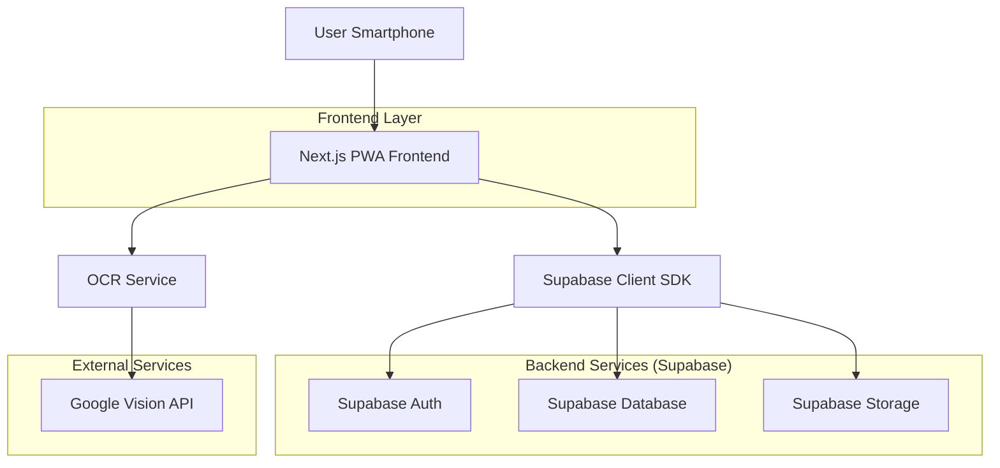
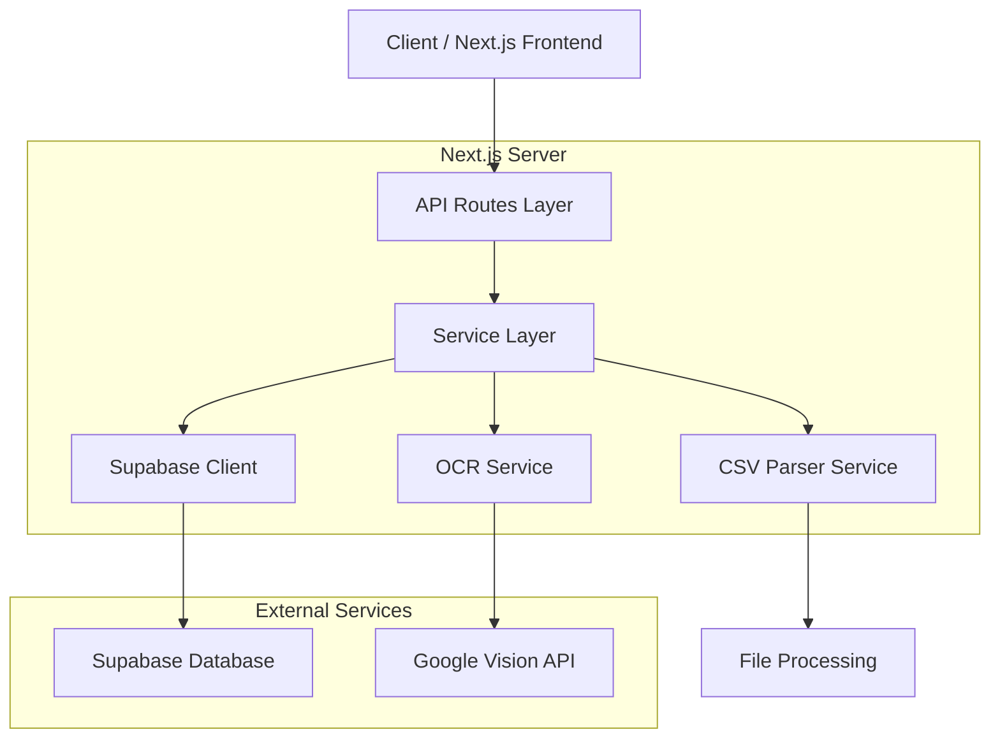
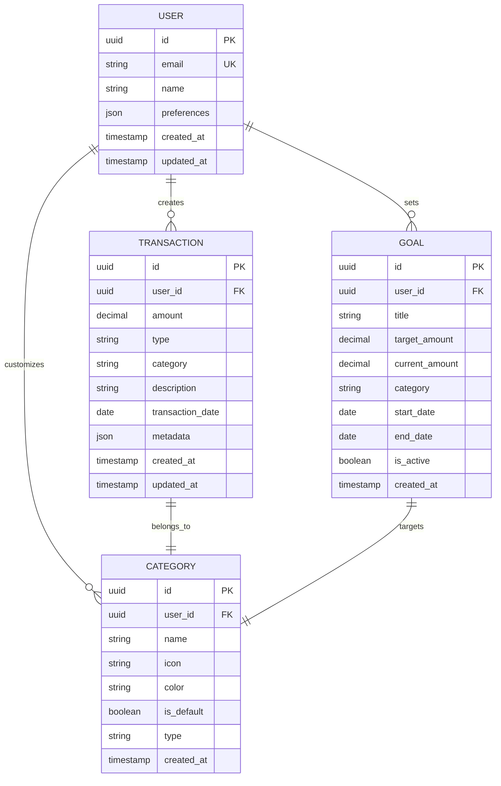

## 1. Arquitetura Geral



## 2. Descrição das Tecnologias

* **Frontend:** Next.js 14 + TypeScript + Tailwind CSS + PWA

* **Backend:** Supabase (BaaS - Backend as a Service)

* **Banco de Dados:** PostgreSQL (via Supabase)

* **Autenticação:** Supabase Auth (Magic Link)

* **Storage:** Supabase Storage para arquivos e imagens

* **ORM/Cliente:** Supabase Client SDK

* **OCR:** Google Vision API para extração de texto de notas

* **Deploy:** Vercel (frontend) + Supabase (backend)

## 3. Definições de Rotas

| Rota                      | Propósito                                      |
| ------------------------- | ---------------------------------------------- |
| `/`                       | Dashboard principal com visão geral financeira |
| `/auth/login`             | Login via magic link                           |
| `/auth/callback`          | Callback de autenticação do Supabase           |
| `/transactions`           | Lista de todas as transações com filtros       |
| `/transactions/new`       | Formulário de nova transação (ganho/despesa)   |
| `/transactions/[id]/edit` | Edição de transação existente                  |
| `/import/csv`             | Upload e processamento de arquivo CSV          |
| `/scan-receipt`           | Captura e processamento OCR de notas fiscais   |
| `/goals`                  | Gerenciamento de metas financeiras             |
| `/goals/new`              | Criação de nova meta financeira                |
| `/settings`               | Configurações do usuário e preferências        |
| `/settings/categories`    | Gerenciamento de categorias personalizadas     |
| `/settings/export`        | Exportação de dados em CSV/Excel               |

## 4. Definições de APIs

### 4.1 Autenticação

**Magic Link Login**

```
POST /api/auth/login
```

Request:

| Parâmetro | Tipo   | Obrigatório | Descrição                                 |
| --------- | ------ | ----------- | ----------------------------------------- |
| email     | string | sim         | Email do usuário para envio do magic link |

Response:

```json
{
  "success": true,
  "message": "Magic link enviado para seu email"
}
```

### 4.2 Transações

**Listar Transações**

```
GET /api/transactions
```

Query Parameters:

| Parâmetro   | Tipo   | Obrigatório | Descrição                     |
| ----------- | ------ | ----------- | ----------------------------- |
| start\_date | string | não         | Data inicial (ISO 8601)       |
| end\_date   | string | não         | Data final (ISO 8601)         |
| category    | string | não         | Categoria da transação        |
| type        | string | não         | "income" ou "expense"         |
| page        | number | não         | Página para paginação         |
| limit       | number | não         | Itens por página (padrão: 50) |

Response:

```json
{
  "data": [
    {
      "id": "uuid",
      "amount": 150.00,
      "type": "income",
      "category": "Limpeza Pós-Obra",
      "description": "Serviço no Condomínio X",
      "date": "2024-01-15",
      "created_at": "2024-01-15T10:30:00Z",
      "updated_at": "2024-01-15T10:30:00Z"
    }
  ],
  "total": 150,
  "page": 1,
  "total_pages": 3
}
```

**Criar Transação**

```
POST /api/transactions
```

Request:

| Parâmetro   | Tipo   | Obrigatório | Descrição                                                       |
| ----------- | ------ | ----------- | --------------------------------------------------------------- |
| amount      | number | sim         | Valor da transação (positivo para ganho, negativo para despesa) |
| type        | string | sim         | "income" ou "expense"                                           |
| category    | string | sim         | Categoria da transação                                          |
| description | string | não         | Descrição opcional                                              |
| date        | string | sim         | Data da transação (ISO 8601)                                    |

### 4.3 Importação CSV

**Processar Arquivo CSV**

```
POST /api/import/csv
```

Request (multipart/form-data):

| Parâmetro    | Tipo   | Obrigatório | Descrição                                                |
| ------------ | ------ | ----------- | -------------------------------------------------------- |
| file         | File   | sim         | Arquivo CSV para processamento                           |
| bank\_format | string | sim         | Formato do banco ("itau", "bradesco", "santander", etc.) |

Response:

```json
{
  "preview": [
    {
      "date": "2024-01-15",
      "description": "PIX RECEBIDO",
      "amount": 250.00,
      "type": "income"
    }
  ],
  "total_rows": 45,
  "session_id": "import_session_uuid"
}
```

**Confirmar Importação**

```
POST /api/import/csv/confirm
```

Request:

| Parâmetro   | Tipo   | Obrigatório | Descrição                  |
| ----------- | ------ | ----------- | -------------------------- |
| session\_id | string | sim         | ID da sessão de importação |
| mappings    | object | sim         | Mapeamento de colunas      |

### 4.4 OCR

**Processar Imagem de Nota**

```
POST /api/ocr/process
```

Request (multipart/form-data):

| Parâmetro | Tipo | Obrigatório | Descrição           |
| --------- | ---- | ----------- | ------------------- |
| image     | File | sim         | Imem da nota fiscal |

Response:

```json
{
  "extracted_data": {
    "total_amount": 89.90,
    "date": "2024-01-15",
    "merchant_name": "MERCADO EXEMPLO",
    "items": [
      {
        "description": "Produto A",
        "quantity": 2,
        "unit_price": 15.00,
        "total": 30.00
      }
    ]
  },
  "confidence": 0.85
}
```

### 4.5 Dashboard

**Estatísticas do Dashboard**

```
GET /api/dashboard/stats
```

Query Parameters:

| Parâmetro | Tipo   | Obrigatório | Descrição                                 |
| --------- | ------ | ----------- | ----------------------------------------- |
| period    | string | não         | "week", "month", "year" (padrão: "month") |

Response:

```json
{
  "current_balance": 1250.50,
  "total_income": 3500.00,
  "total_expense": 2249.50,
  "trend": "up",
  "trend_percentage": 12.5,
  "chart_data": [
    {
      "date": "2024-01-01",
      "balance": 1000.00,
      "income": 500.00,
      "expense": 300.00
    }
  ]
}
```

## 5. Arquitetura do Servidor



## 6. Modelo de Dados

### 6.1 Definição do Modelo



### 6.2 Definição das Tabelas (DDL)

**Tabela de Usuários (users)**

```sql
-- Criar tabela de usuários
CREATE TABLE users (
    id UUID PRIMARY KEY DEFAULT gen_random_uuid(),
    email VARCHAR(255) UNIQUE NOT NULL,
    name VARCHAR(100) NOT NULL,
    preferences JSONB DEFAULT '{}',
    created_at TIMESTAMP WITH TIME ZONE DEFAULT NOW(),
    updated_at TIMESTAMP WITH TIME ZONE DEFAULT NOW()
);

-- Criar índice para email
CREATE INDEX idx_users_email ON users(email);
```

**Tabela de Transações (transactions)**

```sql
-- Criar tabela de transações
CREATE TABLE transactions (
    id UUID PRIMARY KEY DEFAULT gen_random_uuid(),
    user_id UUID NOT NULL REFERENCES users(id) ON DELETE CASCADE,
    amount DECIMAL(10,2) NOT NULL CHECK (amount != 0),
    type VARCHAR(10) NOT NULL CHECK (type IN ('income', 'expense')),
    category VARCHAR(50) NOT NULL,
    description TEXT,
    transaction_date DATE NOT NULL,
    metadata JSONB DEFAULT '{}',
    created_at TIMESTAMP WITH TIME ZONE DEFAULT NOW(),
    updated_at TIMESTAMP WITH TIME ZONE DEFAULT NOW()
);

-- Criar índices
CREATE INDEX idx_transactions_user_id ON transactions(user_id);
CREATE INDEX idx_transactions_date ON transactions(transaction_date DESC);
CREATE INDEX idx_transactions_type ON transactions(type);
CREATE INDEX idx_transactions_category ON transactions(category);
```

**Tabela de Metas (goals)**

```sql
-- Criar tabela de metas
CREATE TABLE goals (
    id UUID PRIMARY KEY DEFAULT gen_random_uuid(),
    user_id UUID NOT NULL REFERENCES users(id) ON DELETE CASCADE,
    title VARCHAR(100) NOT NULL,
    target_amount DECIMAL(10,2) NOT NULL CHECK (target_amount > 0),
    current_amount DECIMAL(10,2) DEFAULT 0 CHECK (current_amount >= 0),
    category VARCHAR(50) NOT NULL,
    start_date DATE NOT NULL,
    end_date DATE NOT NULL,
    is_active BOOLEAN DEFAULT true,
    created_at TIMESTAMP WITH TIME ZONE DEFAULT NOW()
);

-- Criar índices
CREATE INDEX idx_goals_user_id ON goals(user_id);
CREATE INDEX idx_goals_active ON goals(is_active);
CREATE INDEX idx_goals_dates ON goals(start_date, end_date);
```

**Tabela de Categorias (categories)**

```sql
-- Criar tabela de categorias
CREATE TABLE categories (
    id UUID PRIMARY KEY DEFAULT gen_random_uuid(),
    user_id UUID REFERENCES users(id) ON DELETE CASCADE,
    name VARCHAR(50) NOT NULL,
    icon VARCHAR(10) DEFAULT '📊',
    color VARCHAR(7) DEFAULT '#3B82F6',
    is_default BOOLEAN DEFAULT false,
    type VARCHAR(10) CHECK (type IN ('income', 'expense', 'both')),
    created_at TIMESTAMP WITH TIME ZONE DEFAULT NOW()
);

-- Criar índice
CREATE INDEX idx_categories_user_id ON categories(user_id);

-- Inserir categorias padrão para o contexto deles
INSERT INTO categories (name, icon, color, is_default, type) VALUES
    ('Limpeza Pós-Obra', '🧹', '#10B981', true, 'income'),
    ('Serviço Extra', '💪', '#10B981', true, 'income'),
    ('Combustível', '⛽', '#EF4444', true, 'expense'),
    ('Alimentação', '🍽️', '#EF4444', true, 'expense'),
    ('Materiais de Limpeza', '🧼', '#EF4444', true, 'expense'),
    ('Transporte', '🚗', '#EF4444', true, 'expense'),
    ('Outros Gastos', '📦', '#EF4444', true, 'expense');
```

## 7. Segurança e Políticas RLS

### 7.1 Políticas de Row Level Security (RLS)

**Transações**

```sql
-- Habilitar RLS
ALTER TABLE transactions ENABLE ROW LEVEL SECURITY;

-- Permitir leitura apenas das próprias transações
CREATE POLICY "Users can view own transactions" ON transactions
    FOR SELECT USING (auth.uid() = user_id);

-- Permitir inserção apenas com user_id correto
CREATE POLICY "Users can insert own transactions" ON transactions
    FOR INSERT WITH CHECK (auth.uid() = user_id);

-- Permitir atualização apenas das próprias transações
CREATE POLICY "Users can update own transactions" ON transactions
    FOR UPDATE USING (auth.uid() = user_id);

-- Permitir exclusão apenas das próprias transações
CREATE POLICY "Users can delete own transactions" ON transactions
    FOR DELETE USING (auth.uid() = user_id);
```

**Metas**

```sql
-- Habilitar RLS
ALTER TABLE goals ENABLE ROW LEVEL SECURITY;

-- Permitir operações apenas nas próprias metas
CREATE POLICY "Users can manage own goals" ON goals
    FOR ALL USING (auth.uid() = user_id);
```

**Categorias**

```sql
-- Habilitar RLS
ALTER TABLE categories ENABLE ROW LEVEL SECURITY;

-- Permitir visualização de categorias padrão e próprias
CREATE POLICY "Users can view categories" ON categories
    FOR SELECT USING (is_default = true OR user_id = auth.uid());

-- Permitir gerenciamento apenas das próprias categorias
CREATE POLICY "Users can manage own categories" ON categories
    FOR ALL USING (user_id = auth.uid());
```

### 7.2 Permissões de Acesso

```sql
-- Conceder permissões básicas para usuários anônimos (antes do login)
GRANT SELECT ON categories TO anon;

-- Conceder permissões completas para usuários autenticados
GRANT ALL PRIVILEGES ON transactions TO authenticated;
GRANT ALL PRIVILEGES ON goals TO authenticated;
GRANT ALL PRIVILEGES ON categories TO authenticated;
```

## 8. Configuração de Deploy

### 8.1 Vercel (Frontend)

**vercel.json**

```json
{
  "buildCommand": "npm run build",
  "outputDirectory": ".next",
  "devCommand": "npm run dev",
  "installCommand": "npm install",
  "framework": "nextjs",
  "regions": ["gru1"],
  "env": {
    "NEXT_PUBLIC_SUPABASE_URL": "@supabase_url",
    "NEXT_PUBLIC_SUPABASE_ANON_KEY": "@supabase_anon_key",
    "SUPABASE_SERVICE_ROLE_KEY": "@supabase_service_role_key"
  }
}
```

### 8.2 Supabase (Backend)

**Configurações do Projeto:**

* Região: São Paulo (us-east-1)

* Plano: Starter (suficiente para uso inicial)

* Email Templates: Configurar magic link em português BR

* Storage Buckets: Criar bucket "receipts" para imagens de notas

* Rate Limiting: 100 requests por minuto por IP

### 8.3 Variáveis de Ambiente

**.env.local (desenvolvimento)**

```bash
NEXT_PUBLIC_SUPABASE_URL=https://your-project.supabase.co
NEXT_PUBLIC_SUPABASE_ANON_KEY=your-anon-key
SUPABASE_SERVICE_ROLE_KEY=your-service-role-key
GOOGLE_VISION_API_KEY=your-google-vision-key
```

**.env.production**

```bash
NEXT_PUBLIC_SUPABASE_URL=https://your-project.supabase.co
NEXT_PUBLIC_SUPABASE_ANON_KEY=your-anon-key
SUPABASE_SERVICE_ROLE_KEY=your-service-role-key
GOOGLE_VISION_API_KEY=your-google-vision-key
```

## 9. Monitoramento e Manutenção

### 9.1 Logs e Auditoria

* Supabase Logs para queries e autenticação

* Vercel Analytics para performance do frontend

* Google Vision API monitoring para OCR

* Backup automático diário via Supabase

### 9.2 Métricas de Performance

* Tempo de carregamento < 3s em 3G

* Taxa de sucesso de importação CSV > 95%

* Precisão de OCR > 80%

* Disponibilidade do sistema > 99%

### 9.3 Escalabilidade

* Supabase pode escalar automaticamente conforme uso

* Implementar cache com React Query no frontend

* Paginação obrigatória para listas grandes

* Lazy loading para imagens e dados pesados

